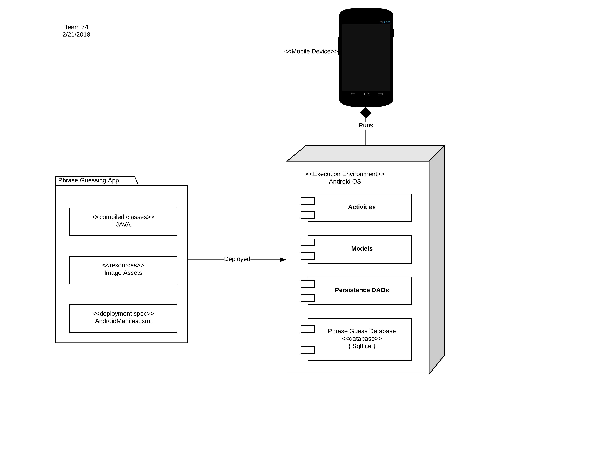

# Design Document

Author: Team74

## 1 Design Considerations

### 1.1 Assumptions

It is assumed the the application will not be added to the Google playstore and will be copied to any device directly.
It is assumed that there will not be more data stored using the applications than the SqlLite database can support.
The application will depend on the Android API version 23.
The application will depend on the Android 6.0's local SqlLite database.

### 1.2 Constraints

The application will not require or use network or cellular connections so all data created through the use of the application will be stored locally on the device in the build-in Android SqlLite database.

### 1.3 System Environment

This application will run on mobile devices that run the Android operating system.  The application will run on the version 23 of the Android API which runs with version 6.0 (Marshmallow) of the Android OS.

## 2 Architectural Design

The components of our system will include the Activities that will make up the UI of our frontend and Controller functionality for our backend.  The other major set of components of our system will include the Model classes.  These models will be used to pass data between the database and the Activities and will also contain some of the basic data specific business logic.  The final component to our system will be the Persistence objects that will know how to store and query data from the database and map it to our model classes.

For the deployment of the application, it will be deployed directly onto mobile devices so the only execution environment that this application is concerned with will be the mobile device's Android system.

### 2.1 Component Diagram

### 2.2 Deployment Diagram

## 3 Low-Level Design

The classes in our Class Diagram below map to our models in our Component Diagram above.  Also, the Activities from our Componment Diagram map to the screens from our UI Design below.

### 3.1 Class Diagram

### 3.2 Database Entity Relation Diagram

## 4 User Interface Design

  
  
  

