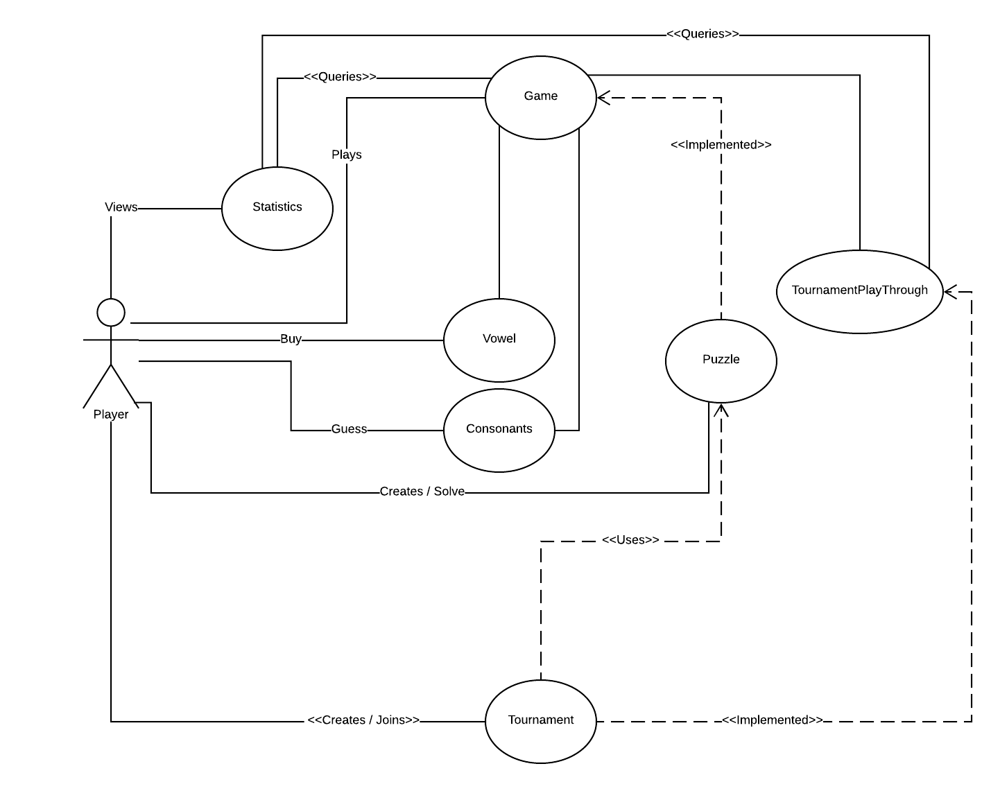

# Use Case Model

**Author**: Team 74

## 1 Use Case Diagram

## 2 Use Case Descriptions

| Requirements | Actor  | Action | Object | Pre-condition   | Post-condition | Scenarios |
|------------  |:-------|:------ |:-------|:------------    |:-----------    |:--------  |
| Player creates puzzle or tournament. | Player | create | 1. Puzzle 2. Tournament | User creates player | Puzzle has 1. puzzle phrase 2. maximum number of allowed wrong guesses 3. unique identifier for puzzle | A player creates a puzzle or a tournament to play Wheel of Fortune. Puzzle has the phrase, unique ID, and the maximum number of wrong guesses. |
| Player plays puzzle or tournament. | Player | play | 1. Puzzle2. Tournament | Puzzles and/or Tournaments are already created | Puzzles/Tournaments are solved, interrupted, or unsolved | A player plays the puzzle or tournament |
| Game displays list of all letters not chosen, total prize, remaining # of wrong guesses. | Game | display | 1. List of all letters not chosen2. Total Prize3. Remaining # of wrong guesses | 1. Total Prize > $0  2. Remaining # of wrong guesses > 0 | Displays: 1. List of all letters not chosen  2. Total Prize 3. Remaining # of wrong guesses | Game displays list of letters not chosen, total prize, and remaining number of guesses. |
| Player guesses consonant. | Player | guess | Consonant | Puzzle phrase is created | 1. Remaining # of wrong guesses increase2. Puzzle phrase reveal 1 character | Player guesses a character within the puzzle phrase. If true, all instances of that character is revealed. If false, then remaining number of guesses decreases by 1 and list of letters not chosen decreases by that character. |
| Player buys vowel. | Player | buy | vowel | Total prize > $300 (vowel costs $300 to buy) | Puzzle phrase reveal corresponding vowel | Player buys vowel for $300, decreasing total prize by $300. |
| Player solves puzzle phrase. | Player | solve | Puzzle phrase | Puzzle phrase is created | 1. Puzzle is solved  2. Total prize captured by Player increased | Player solves the puzzle phrase, all characters are revealed and total prize is captured by the Player. |
| Player interrupts puzzle. | Player | interrupts | Puzzle | Game is within play | Option to continue | Player's game gets interrupted, game gives option to continue from where it was interrupted. |
| Player views statistics. | Player | view | statistics | Player must be created | Displays:  1. The list of puzzles completed + prize  2. The list of tournaments completed by that player + prize   3. The complete list of puzzles with # of players + top prize won   4. The complete list of tournaments with, for each tournament, # of players + top prize won | Player views statistics of all tournaments and puzzles. If none have been played, statistics will display nothing. |
